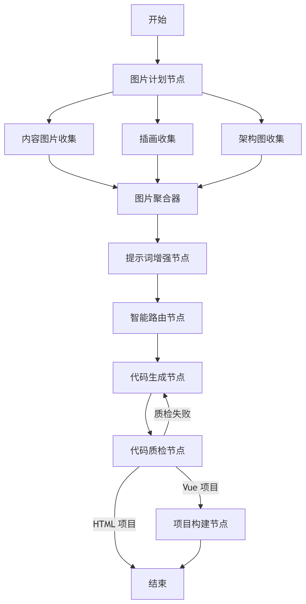
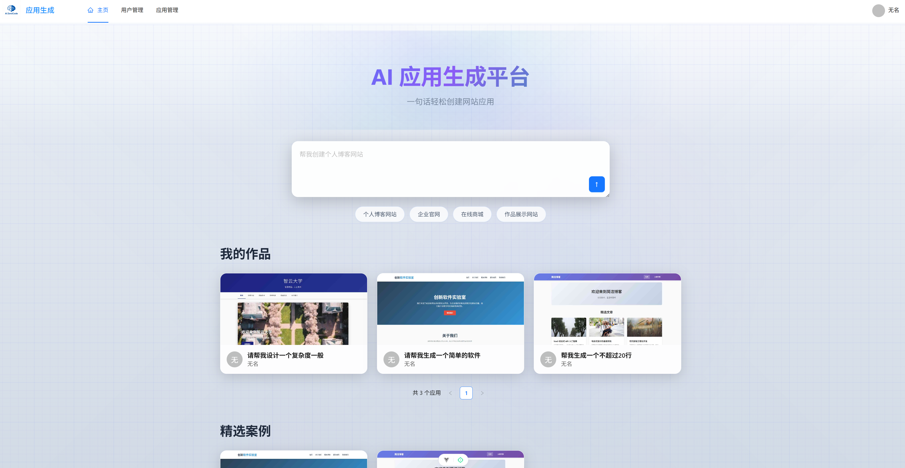
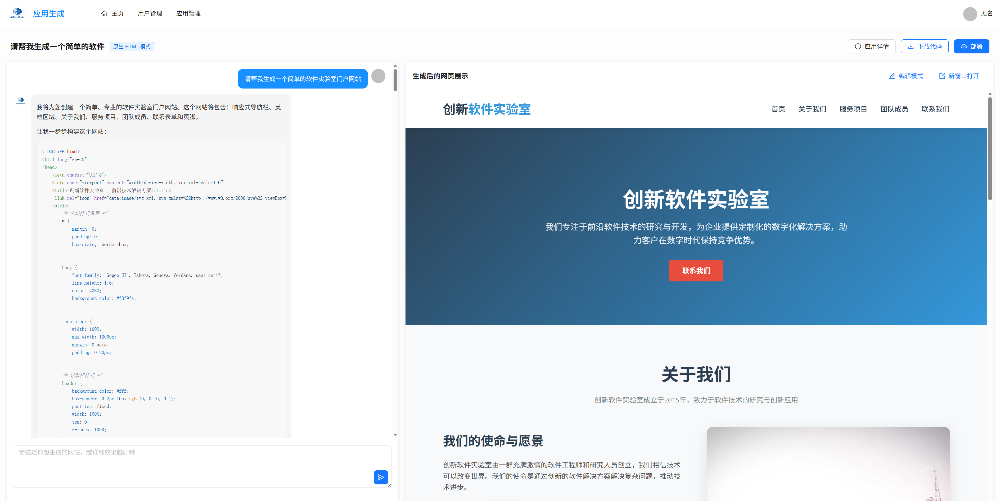
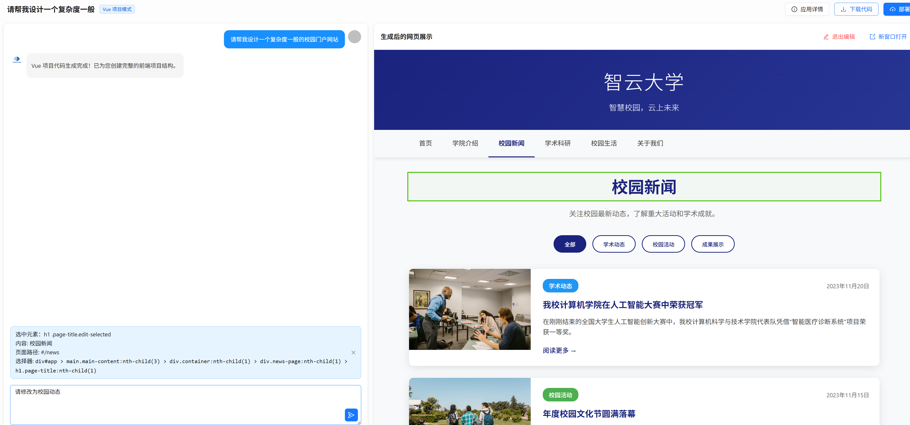
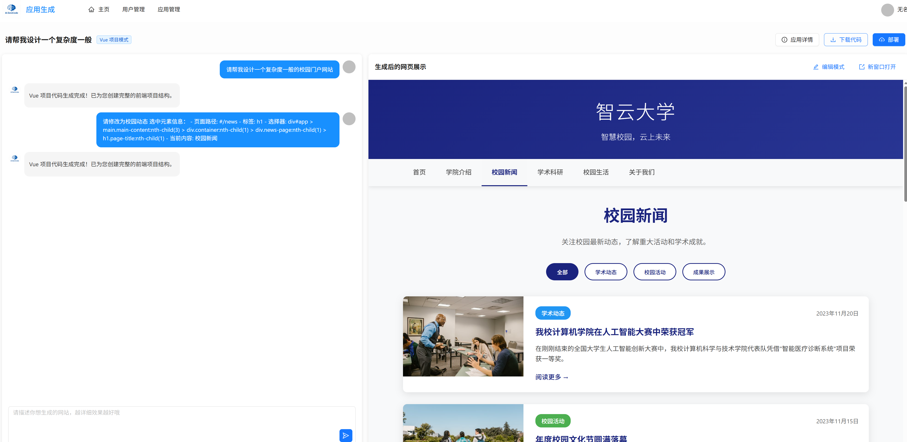

# AI 前端应用生成

---
## 📖 项目简介
基于Spring Boot 3 + LangChain4j + LangGraph4j 的 AI 零代码应用生成平台。用户输入自然语言描述，由 Al Agent自动执行并发素材搜集、代码生成、质量检查和项目构建的完整工作流，最终一键部署为可访问的Web应用。
### ✨ 核心特性

- **🎯 多类型代码生成**: 支持 HTML 单文件、多文件网页应用、Vue 工程等多种类型
- **💬 流式实时响应**: 基于 LangChain4j 实现流式输出，实时查看代码生成过程
- **🛠️ 工具调用集成**: 支持 AI 调用文件保存工具，自动完成代码落地
- **🔄 对话历史管理**: 完整的对话历史记录与上下文管理
- **📦 自动化构建部署**: Vue 项目自动执行 npm install 和 build，生成可部署的 dist 目录

---

## 🏗️ 技术架构

### 核心技术栈

- **后端框架**: Spring Boot 3.5.4
- **AI 框架**: LangChain4j + LangGraph4j 
- **数据库**: MySQL + MyBatis-Flex
- **缓存/会话**: Redis + Spring Session
- **工具库**: Hutool、Lombok
- **浏览器自动化**: Selenium WebDriver (用于网页截图)

### AI 工作流图

## 🚀 主要效果展示
### 主页展示

### 生成网页
- HTML 简单页面实现流式输出（支持局部修改）

- VUE 工程（支持局部修改）

